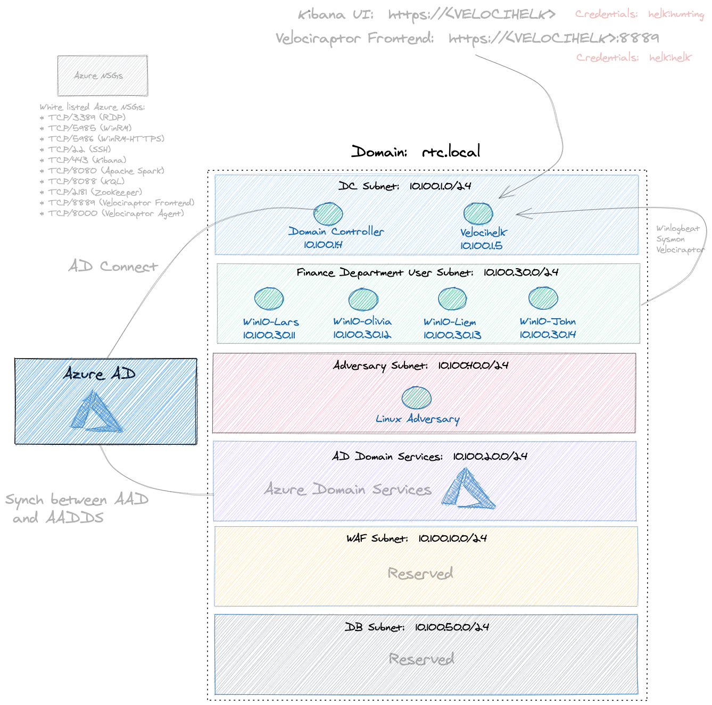
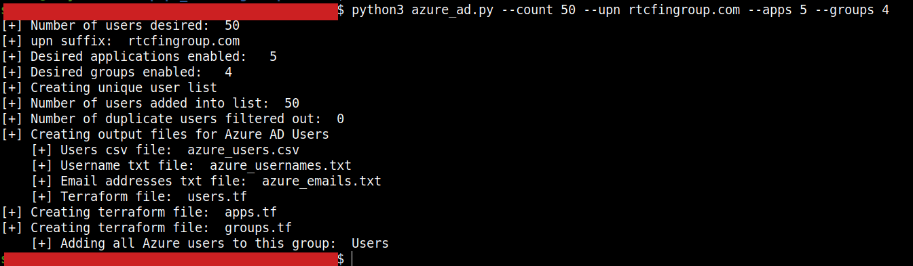
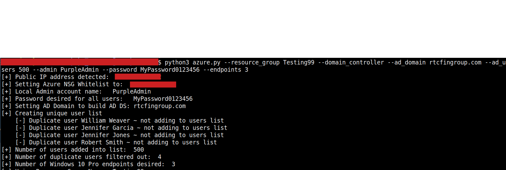

# Valentine's Day Updates:  2/14/22 
PurpleCloud has changed!  Introducing a Terraform generator using python.  Instead of offering terraform templates that have to be manually edited, the starting point is a Python terraform generator.  The python scripts will create your own custom terraform files based on user input.  The terraform template files have been moved to archive.

# Overview
Identity lab supporting Azure AD and Active Directory enterprise deployment with SIEM in Azure.  Easily build your own Pentest / Red Team / Cyber Range in Azure cloud.  PurpleCloud was created as a platform for researching Azure Identity.  This repository contains two basic python scripts.  The first one is ```azure_ad.py``` and it is used to generate the terraform for a custom Azure AD range.  It uses a python library (faker) to generate as many Azure AD users as you desire, also creating AD Groups and AD Applications.  The second script is ```azure.py.```  This script is used to generate a more traditional infrastructure range.  It can create an Active Directory Domain Services range, generating as many AD users as you wish.  It also supports many other features such as Domain Join of Windows 10 systems, in addition to a SIEM instrumented with Sysmon.  These two scripts can be used for separate use cases independently and don't depend on each other.  Or you can use them together to build a Hybrid lab with AD Connect synchronizing identity from the on-premise AD into Azure AD.

## Cost Analysis / Pricing Estimate
As this tool spins up cloud resources, it will result in charges to your Azure subscription.  Efforts have been made to minimize the costs incurred and research the best options for most uses cases.  The best way to use this is reference the estimated cost below, check your Azure costs daily, and verify them against this information included below.  Be sure to tear down all resources when not using them.

There are other small costs associated with Azure cloud resources, but the most expensive resources by far are the Azure Virtual Machines.  When it comes to Compute VM resources, Azure is more expensive than AWS.  If you are looking to run this range in AWS, check out the sister project, BlueCloud:  https://github.com/iknowjason/BlueCloud

By default, both the Windows 10 Pro and Domain Controller are using a ```Standard_A1``` instance size, which is the lowest cost hardware that I could find which will provide sufficient performance.  The Hunting ELK SIEM system requires a scaled up Linux instance size of ```Standard_DS3_v2```.  This is because it uses HELK install option four for data science capabilities.  

Reference the Azure "Windows Virtual Machine Pricing" for the most up to date pricing:
https://azure.microsoft.com/en-us/pricing/details/virtual-machines/windows/

Reference the Azure "Linux Virtual Machines Pricing" for the most up to date pricing on the Linux VM:
https://azure.microsoft.com/en-us/pricing/details/virtual-machines/linux/

Here are the defaults I've researched for this range.  Each Windows and Linux VM should approximately accrue the following with range defaults:
### Table:  Azure Accrued Costs per VM with Windows License Included
| System   |  Default Size  | Default Region |  1 day cost |  7 day cost | 30 day cost |
|----------|----------------|----------------|-------------|-------------|-------------|
| Win10Pro |  Standard_A1   |   US Central   |     $2.21   |   $15.17    |   $64.85    |
|    DC    |  Standard_A1   |   US Central   |     $2.21   |   $15.17    |   $64.85    |
|  HELK    | Standard_DS3_v2|   US Central   |     $7.08   |   $49.27    |   $211.01   |

### Changing Default VM Instance Size in azure.py
To change the default hardware instance sizes for each VM, modify the following variables in azure.py:

```
# The instance size for each system
size_win10 = "Standard_A1"
size_dc    = "Standard_A1"
size_helk  = "Standard_DS3_v2"
```


# Generating an Azure AD lab using azure_ad.py

## Usage Example:  Generate a basic Azure AD lab

```$ python3 azure_ad.py --upn rtcfingroup.com```

**Description:** 
This will generate an Azure AD range with a UPN suffix of ```rtcfingroup.com``` with 100 users. It will output three files.   The Azure AD password for all users will be automatically generated and output after terraform apply.

* **azure_users.csv:** A csv including the Azure AD user's full name, username, and email address.
* **azure_usernames.txt:**  A file including just the usernames.
* **azure_emails.txt:** A file including just the email addresses.
* **users.tf:** Terraform file that will build the users.

## Usage Example:  Generate an Azure AD lab with 1,000 users 
```$ python3 azure_ad.py --upn rtcfingroup.com --count 1000```

**Description:** 
Same as above, except generate 1,000 users in Azure AD.  Running terraform apply will generate a random password shared by all users.  The password applied to all users will be displayed at the end of ```terraform apply```.  To display the passwor again, run ```terraform output```.  


## Usage Example:  Generate a lab with Azure applications and groups
```$ python3 azure_ad.py --upn rtcfingroup.com --count 500 --apps 3 --groups 5```

**Description:**
Same as above, except generate 500 users in Azure AD.  Create 3 Azure applications and 5 groups.  Automatically put the 500 users into separate groups. 

- **apps.tf:**  A terraform file with the Azure applications.
- **groups.tf:**  A terraform file with the Azure groups.


# Generating an Azure infrastructure lab using azure.py 

## Usage Example:  Generate a single Windows 10 Endpoint with Sysmon installed

```$ python3 azure.py --endpoint 1```

**Description:**
This will generate a single Windows 10 Endpoint and generate a random, unique password with a default local Administrator account named 'RTCAdmin'.  This generates four terraform files:
- **main.tf:** Terraform file with resource group and location.
- **network.tf:** Terraform file with VNet and subnets. 
- **nsg.tf:** Terraform file with Network Security Groups.
- **win10-1.tf:** Terraform file with Windows 10 Pro configuration.


## Usage Example:  Build a Domain Controller with Forest and Users + Windows Domain Join 

```$ python3 azure.py --domain_controller --ad_domain rtcfingroup.com --admin RTCAdmin --password MyPassword012345 --ad_users 500 --endpoints 2  --domain_join```

**Description:**
This will create a Domain Controller in dc.tf and install AD DS with forest name of rtcfingroup.com.  This will create a custom local administrator account and password with 500 domain users.  The domain users will be written to ad_users.csv and will have the password specified in --password.  Note that domain join is disabled by default for Windows 10 Pro but the ```domain_join``` parameter enables it for all Windows 10 Pro created.  This will also create two Windows 10 Pro terraform files (win10-1.tf, win10-2.tf) as well as a terraform file for the Domain Controller (dc.tf).

## Usage Example:  Build a Hunting ELK server and automatically export sysmon winlog beat logs 

```$ python3 azure.py --helk --endpoint 1```

**Description:**
This will add a Hunting ELK server with one Windows 10 Endpoint.  The winlogbeat agent will be installed on Windows 10 Pro and the logs will be sent to the HELK server.  Velociraptor will be installed on the HELK server and the Velociraptor agent on Windows 10 Pro.  The endpoint will automatically register to the Velociraptor server running on HELK.  This will create a terraform file for the HELK server (helk.tf)

## Full Usage and Other Details for Advanced Usage:  Azure.py
```--resource_group <rg_name>```:  Name of the Azure resource group to automatically create  (Default:  PurpleCloud)

```--location <location>```:  The Azure location to use (Default:  centralus)

```--endpoints <num_of_endpoints>```:  Number of Windows 10 Professional systems to build (Default: 0)

```--helk```:  Create a hunting ELK server (with Velociraptor installed) (Default:  Disabled)

```--domain_controller```:  Create a Domain Controller and install AD DS with Forest (Default:  Disabled)

```--ad_domain <domain>```:  The name of the AD Domain to provision (Default:  rtc.local)

```--ad_users <num_of_domain_users>```:  The number of AD users to automatically build (Default:  Disabled)

```--admin <admin_username>```:  The Local Administrator account (Default:  RTCAdmin)

```--password <password>```:  The local Administrator password and default AD user password (Default:  auto generate a strong password) 

```--domain_join```:  Join the Windows 10 Pro systems to the AD Domain (Default:  false)

```--auto_logon```:  Automatically logon the domain user with their credentials upon system start (Default:  false)


## Other Options to Manually Edit in azure.py

**Windows 10 Pro configuration:**   The Windows 10 Pro default configuration can be adjusted to meet your needs.

These are located in the ```config_win10_endpoints``` dictionary:

```hostname_base:```  The base Windows 10 hostname (Default: win10)

```join_domain:```  Whether to join the Windows 10 Pro to the AD Domain.  This is disabled by default.  So if you add a DC and want to join the Windows 10 Pro systems to the AD Domain, you can set this to true.  Or you can use the command line parameter ```--domain-join```.

```auto_logon_domain_users:```  Configure the endpoint (via registry) to automatically log in the domain user.  This will randomly select an AD user.  Disabled by default and requires domain join and DC.

```install_sysmon:```  Automatically install Sysmon with Swift on Security configuration (Default:  Enabled)

```install_art:```  Install Atomic Red Team (art).  (Default:  Enabled) 


```
config_win10_endpoint = {
    "hostname_base":"win10",
    "join_domain":"false",
    "auto_logon_domain_user":"false",
    "install_sysmon":"true",
    "install_art":"true",
}
```

**Default AD Users:**   There is a python dictionary specifying the default AD users.  This can be changed to suit your needs.  These are the first five users automaticaly created.  After the first five, users are randomly generated to meet the ```--ad_users <number>``` amount.

Here is the default_ad_users list along with the first user, that can be searched for in the file:
```
default_ad_users = [
    {
        "name":"Lars Borgerson",
        "ou": "CN=users,DC=rtc,DC=local",
        "password": get_password(),
        "domain_admin":"",
        "groups":"IT"
    },
```

**Network Subnets configuration:**   The configuration for the subnets can be adjusted in the python list named ```config_subnets```.  Some changes include changing the default subnet names or adding/removing subnets.  By default there are four subnets created.  

**Other Details:**   

* **Logging Passwords:** By default, all passwords are randomly generated.  So if you are not aware of this, it might be easy to lose track of a password.  For this reason we have added a logging feature that captures all passwords created.  The ```azure.py``` script will automatically log all output to a logfile called ```ranges.log```.  This is for the specific purpose of being able to track the ranges created and the passwords that are auto-generated for AD users and local Administrator accounts. 

* **Azure Network Security Groups:**  By default, the azure.py script will try to auto-detect your public IP address using a request to http://ifconfig.me.  Your public IP address will be used to white list the Azure NSG source prefix setting.  You can over-ride this behavior by changing the ```override_whitelist``` variable to False.  By default it will then use the value set in ```whitelist_nsg```.  This is set to wide open ("*") and you can change this to a static value.

# Getting Started

## Pre-Requisites

* **Python:**  Tested version:  3.8.10

* **Terraform:**  Tested version:  1.1.2

* **Azure account with subscription:**  https://portal.azure.com
 
## Installing 

1. Clone this repository

2. Install the python faker using pip.  This is a dependency of both python scripts to generate users.

```$ pip3 install faker```

3. After you have a valid Azure subscription, create an Azure Service Principal with the correct permissions and add the four environment variables to your local shell using .env or .envrc:

```
export ARM_SUBSCRIPTION_ID="YOUR_SERVICE_PRINCIPAL_VALUES"
export ARM_TENANT_ID="YOUR_SERVICE_PRINCIPAL_VALUES"
export ARM_CLIENT_ID="YOUR_SERVICE_PRINCIPAL_VALUES"
export ARM_CLIENT_SECRET="YOUR_SERVICE_PRINCIPAL_VALUES"
```

Here are some references for creating a Service Principal to use with Azure.

1.  Creating a Service Principal
https://registry.terraform.io/providers/hashicorp/azurerm/latest/docs/guides/service_principal_client_secret

2.  Configuring a Service Principal to manage Azure Active Directory
https://registry.terraform.io/providers/hashicorp/azuread/latest/docs/guides/service_principal_configuration

3.  Microsoft docs:  Creating a Service Principal in Cloud Shell with Bash
https://docs.microsoft.com/en-us/azure/developer/terraform/get-started-cloud-shell-bash?tabs=bash

These are the settings that have worked best.  For Azure AD, set up the Service Principal as Global Administrator and/or the following Graph API permissions:

- Application.ReadWrite.All
- User.ReadWrite.All
- Group.ReadWrite.All

For building the Azure infrastructure resources, assigning the Service Principal a role of ```Owner``` can help as well.

4. Run terraform 
```
terraform init
terraform plan run.plan
terraform apply run.plan
```

## Destroying the Range

Destroy the range resources when you are finished:
```
terraform destroy
```

# Network Diagram 



# Screen Shots




# Use Cases
* Research and pentest lab for Azure AD and Azure Domain Services
* Security testing of Hybrid Join and Azure AD Joined devices
* EDR Testing lab
* PoC / Product Security Lab
* Enterprise Active Directory lab with domain joined devices
* Malware / reverse engineering to study artifacts against domain joined devices
* SIEM / Threat Hunting / DFIR / Live Response lab with HELK + Velociraptor
* Log aggregator architecture to forward logs to a cloud native SIEM (Azure Sentinel)
* Data Science research with HELK server, Jupyter notebooks
* Detection Engineering research with Mordor
