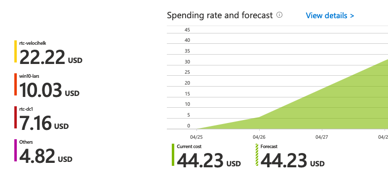

# Cost Analysis

## Important Information
As this tool spins up cloud resources, it will result in charges to your Azure account.  Efforts have been made to minimize the costs incurred, but the tool author is not responsible for any charges or security issues that may result from usage of this tool.  Be sure to tear down all resources when not using them.

## Cost Analysis
Use the Cost Analysis feature of Azure to measure the daily cost of the enabled resources.  Here are some approximate figures with standing up a new subscription and resource group and running PurpleCloud with default modules.  The approximate cost is $44.23 after running the lab for 4 days.

### Table:  Accrued Costs
| Days Running  |  Costs Accrued |
|---------------|----------------|
|    1 day      |     $5.91      |
|    2 days     |     $21.61     |
|    3 days     |     $33.73     |
|    4 days     |     $44.23     |

### Screen Shot from Subscription 
Here is a screen shot showing costs accrued from a new installation on my subscription after 4 days.

 

