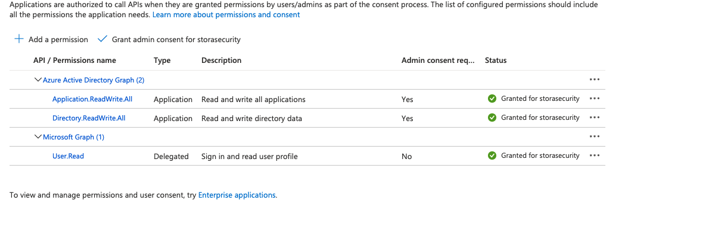

# Installation
**Note:**  Tested on Ubuntu Linux 20.04 

## Requirements
* Azure tenant and subscription
* Global Administrator role
* Terraform:  Tested on v0.14.7
* Ansible:  Tested on 2.9.6

## Note for Azure AD Module:  Azure Active Directory Permission Requirements
If you want to enable and use the Azure Active Directory module, it requires your service principal to have special permissions.  There are two options listed below.  Either one of them will work just fine.  Both are not required:

**Method #1:**  Assign the "Global Administrator" role to the service principal

**Method #2:**  Assign the following API permissions to the service principal:
* Azure Active Directory Graph --> Application.ReadWrite.All
* Azure Active Directory Graph --> Directory.ReadWrite.All
* Microsoft Graph --> User.Read

This is what it looks like:




## Note for Azure AD DS Module:  Azure AD Domain Services Permission Requirements
If you want to enable and use the Azure AD Domain Services, it requires your service principal to have special permissions.  The only requirement here is that your Service Principal must have the "Global Administrator" role assigned to it.

## Installation Steps

**Note:**  Tested on Ubuntu 20.04

**Step 1:** Install Terraform and Ansible on your Linux system

Download and install Terraform for your platform --> https://www.terraform.io/downloads.html

Install Ansible
```
$ sudo apt-get install ansible
```

**Step 2:** Set up an Azure Service Principal on your Azure subscription that allows Terraform to automate tasks under your Azure subscription.


Follow the exact instructions in this Microsoft link:
https://docs.microsoft.com/en-us/azure/developer/terraform/getting-started-cloud-shell

These were the two basic commands that were run based on this link above:
```
az ad sp create-for-rbac --role="Owner" --scopes="/subscriptions/<subscription_id>"
```
and this command below.  From my testing I needed to use a role of "Owner" instead of "Contributor".  Default Microsoft documentation shows role of "Contributor" which resulted in errors.  
```
az login --service-principal -u <service_principal_name> -p "<service_principal_password>" --tenant "<service_principal_tenant>"
```
Take note of the following which we will use next to configure our Terraform Azure provider:
```
subscription_id = ""
client_id = ""
client_secret = ""
tenant_id = ""
```

**Step 3:** Clone this repo
```
$ git clone https://github.com/iknowjason/PurpleCloud.git
```

**Step 4:** First, copy the terraform.tfexample to terraform.tfvars.  Next, using your favorite text editor, edit the terraform.tfvars file for the Azure resource provider matching your Azure Service Principal credentials.  

```
cd PurpleCloud/deploy
cp terraform.tfexample terraform.tfvars
vi terraform.tfvars
```

Edit these parameters in the terraform.tfvars file, replacing "REPLACE_WITH_YOUR_VALUES" to correctly match your Azure environment.  
```
arm_client_id = "REPLACE_WITH_YOUR_VALUES"
arm_client_secret = "REPLACE_WITH_YOUR_VALUES"
subscription_id = "REPLACE_WITH_YOUR_VALUES"
tenant_id = "REPLACE_WITH_YOUR_VALUES"
```

Your terraform.tfvars file should look similar to this but with your own Azure Service Principal credentials:
```
arm_client_id = "7e9c2cce-8bd4-887d-b2b0-90cd1e6e4781"
arm_client_secret = ":+O$+adfafdaF-?%:.?d/EYQLK6po9`|E<["
subscription_id = "aa9d8c9f-34c2-6262-89ff-3c67527c1b22"
tenant_id = "8b6817d9-f209-2071-8f4f-cc03332847cb"
```

**Step 5a: (Optional Azure AD)** If you wish to enable Azure AD, configure the Azure AD provider service principal credentials in the terraform.tvfars file.  Edit these parameters, replacing "REPLACE_WITH_YOUR_VALUES" to correctly match your Azure environment.  These credentials are necessary for the Azure AD provider to use the service principal and create users, groups, and applications with the correct API permissions.

```
aad_client_id = "REPLACE_WITH_YOUR_VALUES"
aad_client_secret = "REPLACE_WITH_YOUR_VALUES"
```

Your terraform.tfvars file should look similar to this but with your own credentials:
```
aad_client_id = "7e9c2cce-8bd4-887d-b2b0-90cd1e6e4781"
aad_client_secret = ":+O$+adfafdaF-?%:.?d/EYQLK6po9`|E<["
```
**Step 5b: (Optional Azure AD)** Uncomment the Azure AD module in main.tf.  It is disabled by default.  Look for this section block and remove the multi-line comments.  It should look like this:

```
##########################################################
## Azure AD Module - Create Azure AD Users, Groups, and Application
##########################################################
module "azure_ad" {
  source              = "../modules/azure_ad"
  upn_suffix          = local.upn_suffix
  tenant_id           = local.tenant_id
}
```

**Step 5c: (Optional Azure AD)** In main.tf, set the following two variables correctly for Azure AD:
* tenant_id
* upn_suffix

The tenant_id variable should be the username associated with your tenant account when it was setup and it forms the universal principal name (UPN) suffix for your AD users.  Let's say your username is acmecorp.  Then the upn suffix will be acmecorp.onmicrosoft.com.  If you have added a custom domain to Azure, then you can use that custom domain as your upn suffix instead of 'tenant_id.onmicrosoft.com'.


**Step 6a: (Optional Azure AD Domain Services)** Azure Domain Servies is disabled by default.  If you wish to enable Azure AD Domain Services, uncomment the Azure AD Domain Services module in main.tf.  Look for this section block and remove the multi-line comments.  It should look like this at the beginning and end of the module:
```
module "azure_adds" {
<Skipping Lines>
}
```

**Step 6b: (Optional Azure AD Domain Services)** In main.tf, set the following two variables correctly for Azure AD Domain Services:
* tenant_id_ds
* upn_suffix_ds

**Step 7:**  Edit the terraform.tfvars file to include your source network prefix for properly white listing Azure Network Security Groups (NSGs).
Edit the following file:  deploy/terraform.tfvars
At the bottom of the file, uncomment the "src_ip" variable and populate it with your correct source IP address.  If you don't do this, the Azure NSGs will open up your two VMs to the public Internet.  Below is exactly where the variable should be uncommented and an example of what it looks like:
```
# Set variable below for IP address prefix for white listing Azure NSG
# uncomment variable below; otherwise, all of the public Internet will be permitted
# https://ifconfig.me/
# curl https://ifconfig.me
src_ip = "192.168.87.4"
```

**Step 8:** Run the commands to initialize terraform and apply the resource plan

```
$ cd PurpleCloud/deploy
$ terraform init
$ terraform apply -var-file=terraform.tfvars -auto-approve
```

This should start the Terraform automated deployment plan

**Step 9:** Optional:  Unzip and run Badblood from C:\terraform directory (https://github.com/davidprowe/BadBlood)
