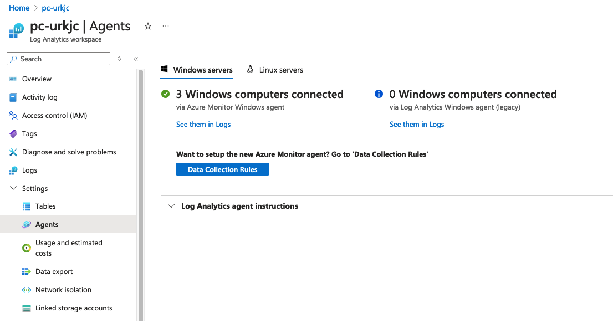
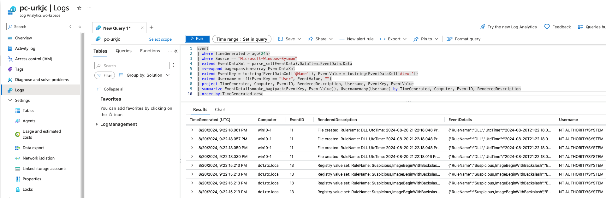
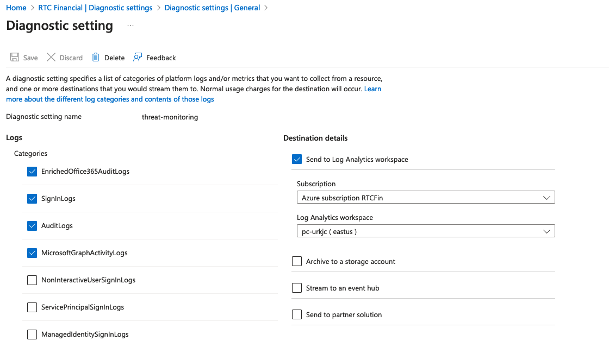

# Microsoft Sentinel lab

## Overview
This tool generates an Azure sentinel lab with optional Windows 10 Endpoints forwarding logs to the Sentinel Log Analytics workspace.  Optionally configure a Domain Controller with Domain Join.  Windows 10 and Domain Controller machines will automatically install and configure the latest Azure Monitor Agent (AMA) and ship Sysmon and Windows event logs to the Log Analytics Workspace.  The endpoints and DC will install Sysmon by default. The default terraform configuration included will also add a diagnostic setting that sends Entra ID Sign In, Audit, Enriched O365 Audit logs, and Graph Audit logs to the Log Analytics Workspace that is created.   

### Important Note
This generator lives in the ```generators/sentinel``` directory.  Navigate into this directory first.
```
cd generators/sentinel
```

## Updated Monitoring Agent and KQL Queries
The latest Azure Monitor Agent (AMA) has been added to this lab for automated deployment via terraform and powershell.  This agent automatically deploys on all Windows 10 and the Domain Controller.  It also ships Windows Security event logs and Sysmon logs to the Log Analytics Workspace.

After the VMs are built, you can navigate into the Log Analytics Workspace and verify the **Agents** are active and deployed, as shown in the image below:
It should show the number of ```Windows computers connected``` matching the equivalent number you built with terraform.



A data collection rule is created for each VM and can be customized in terraform by looking at the ```azurerm_monitor_data_collection_rule``` resource.  By default, an xpath configuration is built that sends both sysmon and windows security event logs.

To view the logs, navigate to the ```log analytics workspace``` and click on the **Logs** option.  You then have a workspace for KQL queries.  Here are two examples below which can query Sysmon and Security event logs.


**Example KQL Query 1:  For all Sysmon logs**

```commandline
Event
| where TimeGenerated > ago(24h)
| where Source == "Microsoft-Windows-Sysmon"
| extend EventDataXml = parse_xml(EventData).DataItem.EventData.Data
| mv-expand bagexpansion=array EventDataXml
| extend EventKey = tostring(EventDataXml['@Name']), EventValue = tostring(EventDataXml['#text'])
| extend Username = iff(EventKey == "User", EventValue, "")
| project TimeGenerated, Computer, EventID, RenderedDescription, Username, EventKey, EventValue
| summarize EventDetails=make_bag(pack(EventKey, EventValue)), Username=any(Username) by TimeGenerated, Computer, EventID, RenderedDescription
| order by TimeGenerated desc
```

**Example KQL Query 2:  For all Windows Security event logs**

```commandline
Event
| where TimeGenerated > ago(24h)
| where EventLog == "Security"
| extend EventDataXml = parse_xml(EventData).DataItem.EventData.Data
| mv-expand bagexpansion=array EventDataXml
| extend EventKey = tostring(EventDataXml['@Name']), EventValue = tostring(EventDataXml['#text'])
| extend Username = iff(EventKey == "TargetUserName" or EventKey == "SubjectUserName", EventValue, "")
| project TimeGenerated, Computer, EventID, RenderedDescription, Username, EventKey, EventValue
| summarize EventDetails=make_bag(pack(EventKey, EventValue)), Username=any(Username) by TimeGenerated, Computer, EventID, RenderedDescription
| order by TimeGenerated desc
```

### Entra ID Diagnostic Setting Logs

By default, a diagnostic setting is created that sends Entra ID Sign In, Audit, Enriched O365 Audit logs, and MS Graph Activity logs to the Log Analytics Workspace.  This is done by the ```azurerm_monitor_aad_diagnostic_setting``` resource found in sentinel.tf.  

Adding this diagnostic setting requires special privileges for your terraform Service Principal to have authorized to read and write changes to aadiam resources (Azure Diagnostic Settings).  You must add a special role to your SP.  You can let terraform run and it will show an error.  You can simply comment out this resource temporarily.
1. Ensure that owner permissions are added for the SP
2. Ensure that SP has Global Administrator permissions
3. Get the ```object_id``` of your terraform service principal.  You can get this from the Azure portal or by looking at the error returned by terraform.
4. Run this command while logged in as global admin with **az login**, changing the ```SP_OBJECT_ID``` to be your terraform Service Principal's ```object_id```.  The ```--role ID``` is for owner role which you should have added for your SP in step 1.
```commandline
az role assignment create --assignee-principal-type  ServicePrincipal --assignee-object-id <SP_OBJECT_ID> --scope "/providers/Microsoft.aadiam" --role b24988ac-6180-42a0-ab88-20f7382dd24c
```



With the power of IaC automation with terraform, you can ensure that azure audit and sign in logs are sent to your LAW.  Here are some example KQL queries for getting these logs:

**Example KQL Query 3:  Azure Sign-in logs**
```commandline
SigninLogs
| where TimeGenerated >= ago(7d)
| project TimeGenerated, UserPrincipalName, AppDisplayName, ResourceDisplayName, IPAddress, Status
| order by TimeGenerated desc
```

**Example KQL Query 4:  Azure Audit logs**
```commandline
AuditLogs
| where TimeGenerated >= ago(7d)
| project TimeGenerated, OperationName, TargetResources, InitiatedBy, ResultReason
| order by TimeGenerated desc
```

**Example KQL Query 5:  Microsoft Graph Activity logs**
```commandline
MicrosoftGraphActivityLogs
```

**Example KQL Query 6:  Office 365 Enriched Audit logs**
```commandline
EnrichedMicrosoft365AuditLogs
```


## Usage Examples

### Example 1:  Simple Microsoft Sentinel lab
 
```
python3 sentinel.py
```

This generates a Microsoft Sentinel lab with a Log Analytics workspace.

This generates a terraform format HCL file for ```sentinel.tf``` and ```providers.tf```.

```-l <LOCATION>```:  Specify a different location (Default: eastus)

```-odc```:  Optionally enables the Office 365 data connector for Sentinel.

```-adc```:  Optionally enables the Azure AD data connector for Sentinel.

### Example 2:  One Windows 10 Endpoint with Sysmon installed

This generates a single Windows 10 Endpoint with Sysmon and Atomic Red Team (ART) installed.

```
python3 sentinel.py --endpoint 1
```

All Windows 10 Pro systems will automatically send logs to Sentinel.

### Example 3: Domain Controller with Forest and Users + Windows Domain Join (Randomly Generate Users)

```
python3 sentinel.py --domain_controller --ad_domain rtcfingroup.com --admin RTCAdmin --password MyPassword012345 --ad_users 500 --endpoints 2  --domain_join
```

**Description:**

This will automatically create an Microsoft Sentinel deployment.  This will also create a Domain Controller in dc_sentinel.tf and install AD DS with forest name of rtcfingroup.com.  This will create a custom local administrator account and password with 500 domain users.   In this example, the domain users are randomly generated using the command line flag of ```--ad_users``` for a total of 500 users.  The domain users will be written to ad_users.csv and will have the password specified in --password.  Note that domain join is disabled by default for Windows 10 Pro but the ```domain_join``` parameter enables it for all Windows 10 Pro created.  This will also create two Windows 10 Pro terraform files (win10-1.tf, win10-2.tf) as well as a terraform file for the Domain Controller (dc_sentinel.tf).  For the two Windows 10 Pro endpoints, they will be configured with the Microsoft Monitoring Agent (MMA) to ship logs to Log Analytics Workspace with Microsoft Sentinel.

### Example 4: Domain Controller with Forest and Users + Windows Domain Join (Import Custom Users from CSV)

```
python3 sentinel.py --domain_controller --ad_domain rtcfingroup.com --admin RTCAdmin --password MyPassword012345 --csv users.csv --endpoints 2  --domain_join
```

**Description:**
Same capabilities as above, except it can import a custom list of Domain Users into active directory on the DC instance.  The script checks to make sure that users are in the correct format.  An example CSV showing five users is listed below:

```
name,upn,password,groups,oupath,domain_admin
Lars Borgerson,larsborgerson@rtcfingroup.com,MyPassword012345,IT,OU=IT;DC=rtcfingroup;DC=com,False
Olivia Odinsdottir,oliviaodinsdottir@rtcfingroup.com,MyPassword012345,IT,OU=IT;DC=rtcfingroup;DC=com,True
Liem Anderson,liemanderson@rtcfingroup.com,MyPassword012345,IT,OU=IT;DC=rtcfingroup;DC=com,False
John Nilsson,johnnilsson@rtcfingroup.com,MyPassword012345,IT,OU=IT;DC=rtcfingroup;DC=com,False
Jason Lindqvist,jasonlindqvist@rtcfingroup.com,MyPassword012345,IT,OU=IT;DC=rtcfingroup;DC=com,True
```

## Details

### Updating Files Automatically Used

There are a few important files that are used in the range that are automatically uploaded and downloaded to resources.  They can be easily customized.

* **Sysmon.zip:**  This range includes Sysmon version 14.  It lives in ```shared/Sysmon.zip```.  This file gets pushed to a storage container where all Windows 10 endpoints download it.  You can replace it for customizations.

* **AzureADConnect.msi:**  This range includes version 2.x of AzureADConnect MSI installer.  It lives in ```shared/AzureADConnect.msi```.  This file gets pushed to a storage container where the DC downloads it to the local Administrator desktop.  You can replace it for customizations.

* **sysmonconfig-export.xml:**  The sysmon configuration file gets uploaded to a storage container and downloaded by all Windows 10 endpoints.  It lives in ```files/sysmon/sysmonconfig-export.xml```.

### Advanced Command Line
 
```--resource_group <rg_name>```:  Name of the Azure resource group to automatically create  (Default:  PurpleCloud)

```--location <location>```:  The Azure location to use (Default:  eastus)

```--endpoints <num_of_endpoints>```:  Number of Windows 10 Professional systems to build (Default: 0)

```--domain_controller```:  Create a Domain Controller and install AD DS with Forest (Default:  Disabled)

```--ad_domain <domain>```:  The name of the AD Domain to provision (Default:  rtc.local)

```--ad_users <num_of_domain_users>```:  The number of AD users to automatically build (Default:  Disabled)

```--csv <csv_file>```:  A custom CSV file to use that will load domain users on the DC's AD DS  (Default:  Disabled)

```--admin <admin_username>```:  The Local Administrator account (Default:  RTCAdmin)

```--password <password>```:  The local Administrator password and default AD user password (Default:  auto generate a strong password)

```--domain_join```:  Join the Windows 10 Pro systems to the AD Domain (Default:  false)

```--auto_logon```:  Automatically logon the domain user with their credentials upon system start (Default:  false)

### How AD Builds on the DC

Some notes I've gathered on AD usage and building.

* Azure AD Connect:  The Azure AD connect MSI is included in ths repo.  It can be upgraded by replacing the file in ```shared/AzureADConnect.msi```.  The current version is 2.x of AD Connect.  The file is uploaded to the storage container and then downloaded to the local Administrator's desktop.

* The bootstrap script for building Active Directory is contained in ```files/dc/bootstrap-dc.ps1.tpl```.  This script is used to build AD DS on the dc instance created in dc.tf.

* After terraform runs, the actual rendered dc bootstrap script (with variables) is output to ```output/dc/bootstrap-dc1.ps1.```  For troubleshooting you can copy that script to the DC and run it.

* The ```ad_users.csv``` file is the name of the file that the DC uses to build AD.  It is uploaded to the storage container that is created and downloaded automatically by the DC.  Look in ```C:\terraform\ad_users.csv``` to look at this file if needed.

* When using the ```--csv <file1>``` to specify your own AD users CSV, how this works:  That file is copied to ```ad_users.csv``` and it is uploaded to the storage container, and downloaded to the DC.  Same as above, it is copied into C:\terraform\ad_users.csv where the bootstrap script parses it.

* For auto_logon domain users:  An AD domain user is randomly selected for logging on that Windows 10 Pro endpoint.  To customize which domain user is used, you can manually edit the windows 10 terraform file (i.e., win10-1.tf).

### Edit script options in sentinel.py

**Windows 10 Pro configuration:**   The Windows 10 Pro default configuration can be adjusted to meet your needs.

These are located in the ```config_win10_endpoints``` dictionary in ```sentinel.py```:

```hostname_base:```  The base Windows 10 hostname (Default: win10)

```join_domain:```  Whether to join the Windows 10 Pro to the AD Domain.  This is disabled by default.  So if you add a DC and want to join the Windows 10 Pro systems to the AD Domain, you can set this to true.  Or you can use the command line parameter ```--domain-join```.

```auto_logon_domain_users:```  Configure the endpoint (via registry) to automatically log in the domain user.  This will randomly select an AD user.  Disabled by default and requires domain join and DC.

```install_sysmon:```  Automatically install Sysmon with Swift on Security configuration (Default:  Enabled)

```install_art:```  Install Atomic Red Team (art).  (Default:  Enabled)

```
config_win10_endpoint = {
    "hostname_base":"win10",
    "join_domain":"false",
    "auto_logon_domain_user":"false",
    "install_sysmon":sysmon_endpoint_config,
    "install_art":"true",
}
```


**Default AD Users:**   There is a python dictionary specifying the default AD users.  This can be changed to suit your needs.  These are the first five users automaticaly created.  After the first five, users are randomly generated to meet the ```--ad_users <number>``` amount.

Here is the default_ad_users list along with the first user, that can be searched for in the file:
```
default_ad_users = [
    {
        "name":"Lars Borgerson",
        "ou": "CN=users,DC=rtc,DC=local",
        "password": get_password(),
        "domain_admin":"",
        "groups":"IT"
    },
```

**Network Subnets configuration:**   The configuration for the subnets can be adjusted in the python list named ```config_subnets```.  Some changes include changing the default subnet names or adding/removing subnets.  By default there are four subnets created.

**Other Details:**

* **ranges.log:**  The ranges.log file writes out important information as the range is built, such as VM details.  You can use it to track things.

* **Logging Passwords:** By default, all passwords are randomly generated.  So if you are not aware of this, it might be easy to lose track of a password.  For this reason we have added a logging feature that captures all passwords created.  The ```ad.py``` script will automatically log all output to a logfile called ```ranges.log```.  This is for the specific purpose of being able to track the ranges created and the passwords that are auto-generated for AD users and local Administrator accounts. You can also type ```terraform output``` as a secondary way to get the password and details for each virtual machine.

* **Azure Network Security Groups:**  By default when you run terraform apply, the security group is wide open to the public Internet allowing ```0.0.0.0/0```. To lock this down: your public IPv4 address can be determined via a query to ifconfig.so and the terraform.tfstate is updated automatically. If your location changes, simply run terraform apply to update the security groups with your new public IPv4 address. If ifconfig.me returns a public IPv6 address, your terraform will break. In that case you'll have to customize the white list. To change the white list for custom rules, update this variable in ```nsg_sentinel.tf```:  

```
locals {
  #src_ip = chomp(data.http.firewall_allowed.response_body)
  src_ip = "0.0.0.0/0"
}
```

* **Outputs:** After the terraform resources are applied and build, you can type ```terraform output``` to get some important information such as the public IP address of VMs in addition to credentials for OS.

### Terraform Outputs
You can get the details of each Virtual Machine, including passwords, by typing ```terraform output```.

## Demo
A video demonstration of Sentinel with options and illustrations.

[](https://youtu.be/_jlqtqN4Iiw "Sentinel Demo")
